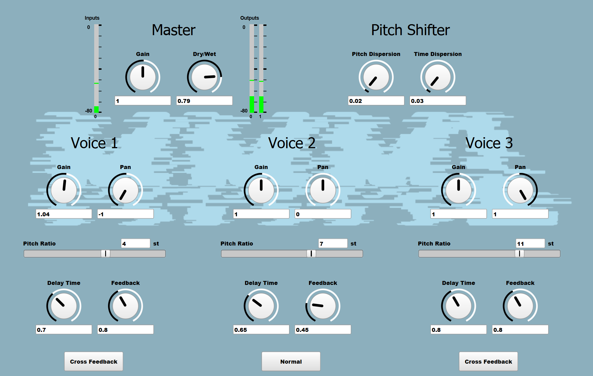
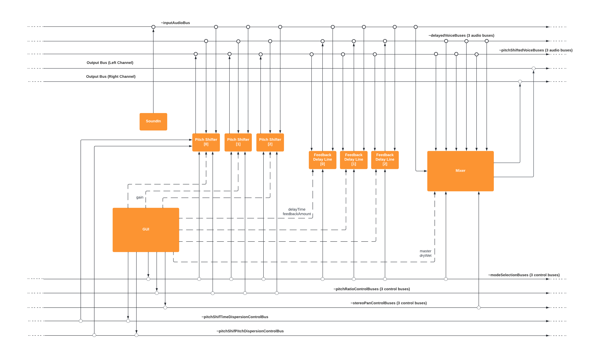

# group3-hw-SC-ASE
Group 3 repository for the SC homework of CMLS 2022.

# HarMMMLonizer

HarMMMLonizer is a real-time harmonizer implemented in SuperCollider. The software implements a DSP system featuring mono input and stereo output. The DSP chain includes a delay line block which supports different feedback setups. Furthermore, a graphical user interface enables the musician to control available parameters, each specifically related to pitch shifting, delay effect and master. HarMMMLonizer supports three additional pitched voices to build the harmony, but a global variable within the code enables the programmer to change the number of voices. As the software is designed, this can be made without changing the software architecture and design (see figure below).

  

## Requirements and First Run
To run the code and start experimenting with HarMMMLonizer, the user should first install the Feedback Quark. A complete guide to SuperCollider Quarks and their installation is available at the following link: 
[Quarks guide](https://github.com/supercollider-quarks/quarks)
The easiest way to install Quarks is by running `Quarks.gui` and select the Feedback Quark for installation.
If you run into troubles during the installation from the GUI, you can alternatively download and install it manually (see link above).

Using FBNode UGen we got the following error `ERROR: Non Boolean in test.`
See [here](http://supercollider.sourceforge.net/wiki/index.php/If_statements_in_a_SynthDef) for more info.  
This is due to our need of using it inside a SynthDef, but as we don't need the piece of code causng the error, we can simply comment it.
So before running the application follow these steps:
1. Open Quarks folder: `Quarks.openFolder`
2. Open the file `Fb.sc` inside the Feedback folder
3. Comment out lines 94 to 97 and save
4. From SuperCollider menu launch `Language` -> `Recompile Class Library`

To run the application, from SuperCollider menu launch `Language` -> `Evaluate File`

## Graphical User Interface
The graphical user interface of the software provides the musician with three main sections:

- **Master section**:
  - **Gain**: sets master volume of the final output.
  - **Dry/Wet**: controls dry/wet balance between the clean input signal and the pitched voices.
  - **Meters**: shows input and output levels.

- **Pitch shifter**:
  - **Pitch Dispersion**: sets the maximum random deviation that of the pitch from the pitchRatio.
  - **Time Dispersion**: adds a random offset to the delay of each grain. Can be used to alleviate the effect due to uniform grain placement. 

- **Voices section**:
  - **Gain**: sets the gain to be applied to the single voice.
  - **Pan**: manages the position of the voice in the stereo panorama.
  - **Pitch Ratio**: sets the target pitch of the voice by selecting the pitch ratio value given in number of semitones above or below the original pitch.
  - **Delay Time**: sets the delay time in milliseconds.
  - **Feedback**: is related to the feedback amount value.
  - **Feedback Mode**: button enables the artist to choose between the three different feedback setups implemented: Normal, Pitch Feedback and Cross Feedback.

### Delay Modes
The harMMMLonizer also features three delay modes:
- **Normal Feedback**: any input signal is routed to the Delay Line synthesizer, attenuated or boosted by feedbackAmount parameter and then again routed to the Delay Line synth, recursively.
  
- **Pitch Feedback**: each recursive iteration does not simply delay the signal, but applies the pitch-shift too. The result is an echo where pitch increases (or decreases) each iteration by the Pitch Ratio parameter set through the GUI. The result is finally reproduced, along with the original signal, resembling an echo-like effect.

- **Cross Feedback**: the third mode was designed to generate an effect that would bounce the two output channels, exploiting stereo Pan control related to the single voice, but featuring the possibility of signal interchange between channels.

## Software Architecture
The architecture of the whole software consists of two main components: the audio processing block, responsible for signal processing, and the graphical user interface (GUI) which implements the graphical component of the software itself.
The audio processor in turn is composed of three functional blocks which are the Harmonizer, a Delay Line and a Mixer. These blocks were implemented through SuperCollider language as SynthDefs (Synthesizer Definitions) with specific available arguments with respect to what parameters the musician needs to control through the GUI. An additional block was implemented with the purpose of collecting the input signal coming from the sound card and writing it on a specific bus so that the implemented synthesizers can read it and compute processing operations on the signal.
The graphical user interface shows three main sections, one for each harmonized voice so that the user can select the desired values for the parameters of the harmonizer and delay line. Furthermore, a mixer section is made available in order to allow the musician to control master volume of the final output and dry/wet balance between the clean input signal and harmonized voices.
The figure below illustrates the diagram of the entire software architecture.

  

***You’re now ready to jump into wonderful HarMMMLonizer world. Enjoy the experience!***

